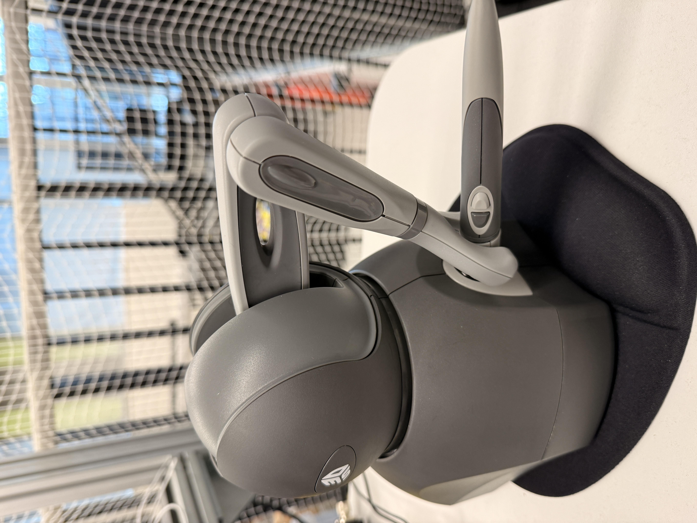

# Sawyer + 3D Systems Touch X Teleop

ROS Noetic workspace for teleoperating a Rethink Robotics **Sawyer** arm with a
**3D Systems Touch X** haptic device, running fully inside Docker.

Pipeline: `Touch X (6-DoF pose)` → `RelaxedIK` → `intera_interface` → `Sawyer`.

---

press and hold dark grey while teleoperating. press lighter grey to open/close the gripper.

## RUN the code

#### step 1:
```bash
export REPO_PATH=$HOME/rpl_sawyer
mkdir -p $REPO_PATH
cd $REPO_PATH
git clone https://github.com/EvaEkhteyary/Sawyer_teleop_with_touchx-3D-system.git
cd Sawyer_teleop_with_touchx-3D-system
```

Install the Touch X driver on the host (one-time — registers udev rules so the container can see the device over USB):
#### step 2:
```bash
cd external/TouchDriver
./install_haptic_driver
cd ../..
```
#### step 3: 
```bash
docker build -t sawyer_haptic .
```

if step 3, gives permission denied error when running docker commands, add your user to the docker group:
```bash
sudo usermod -aG docker $USER
newgrp docker
```

once fixed, repeat the step 3 again.

#### step 4:

```bash
xhost +local:root

docker run -it --privileged --net=host \
  -e DISPLAY=$DISPLAY \
  -e QT_X11_NO_MITSHM=1 \
  -v /tmp/.X11-unix:/tmp/.X11-unix \
  -v $REPO_PATH/Sawyer_teleop_with_touchx-3D-system/external/OpenHaptics:/opt/OpenHaptics:ro \
  -v $REPO_PATH/Sawyer_teleop_with_touchx-3D-system/external/TouchDriver:/root/TouchDriver_2024_09_19:ro \
  -v $REPO_PATH/Sawyer_teleop_with_touchx-3D-system/external/TouchLibs:/usr/lib/TouchLibs:ro \
  -v /dev/bus/usb:/dev/bus/usb \
  -w /root/sawyer_haptic_workspace \
  sawyer_haptic:latest
```

Edit `intera.sh` — set `robot_hostname` to the robot IP and `your_ip` to your computer's IP. Then source it:

```bash
source devel/setup.bash
nano intera.sh
source intera.sh
```

Test ROS comms:

```bash
rostopic list
```

Terminal 1:

```bash
roslaunch omni_common omni_state.launch
```

Terminal 2:

```bash
sudo docker ps
sudo docker exec -it <container_name_or_id> bash
source devel/setup.bash
source intera.sh
roslaunch touchx_sawyer_teleop test_touchx_viz.launch
```

### NOTE: you might need to change some directory inside the urdf and launch file.

---

### how it works:

once both terminals are running, you will notice that the touch has two button:
- press dark grey to teleoperate
- press light grey for open and closing the gripper.

## Troubleshooting

### `OSError: ... librelaxed_ik_lib.so: cannot open shared object file`
`relaxed_ik_core` is a Rust library whose compiled `.so` is **not** committed to git
(`target/` is a build artifact). The Docker image builds it for you. If you see this error:

- **Rebuild the image** (`docker build -t sawyer_haptic .`) if you built it from an older
  version of this repo — the fix lives in the image, not in a mounted volume.
- **Running outside Docker?** Build the library by hand:
  ```bash
  cd src/relaxed_ik_core
  cargo build --release
  # the wrapper loads target/debug/, so point it at the release build:
  mkdir -p target/debug
  ln -sf ../release/librelaxed_ik_lib.so target/debug/librelaxed_ik_lib.so
  ```

### `libGL error: failed to load driver: nouveau`
Harmless — RViz can't get hardware OpenGL inside the container and falls back to software
rendering. To silence it: `export LIBGL_ALWAYS_SOFTWARE=1`.
